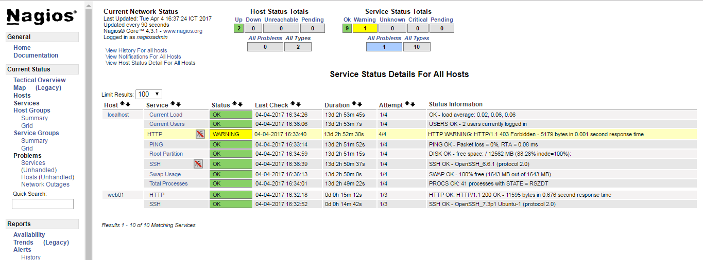
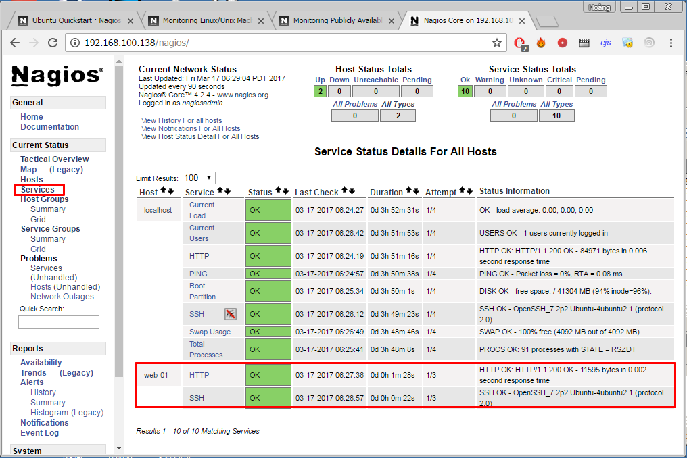

## Hướng dẫn cài đặt Nagios Core

### Table of contents

- [ 1. Chuẩn bị ](#1)
    -   [1.1 Chuẩn bị môi trường cài đặt](#1.1)
    -   [1.2 Tạo user cho Nagios](#1.2)
- [ 2. Cài đặt Nagios ](#2)
    - [2.1 Cài đặt Nagios Core và Plugin](#2.1)
    - [2.2 Cấu hình Web UI](#2.2)
    - [2.3 Cấu hình tường lửa UFW](#2.3)
- [3. Tham khảo](#3)

<a name="1"></a>
### 1. Chuẩn bị

`Nagios Core` là hệ thống giám sát Opensource khá mạnh mẽ, đi kèm với nó là những plugin có thể theo dõi tài nguyên hệ thống và các dịch vụ như HTTP, FTP, SSH, SMTP, v.v... Bài này sẽ hướng dẫn các bạn cài đặt và cấu hình giám sát cơ bản một host Linux có 2 dịch vụ là SSH và HTTP. 

<a name="1.1"></a>
#### 1.1 Chuẩn bị môi trường cài đặt

Để có thể cài đặt và sử dụng được Nagios Core, chúng ta phải cài đặt một số thư viện và các gói dịch vụ đi kèm.

```
sudo apt-get install autoconf gcc libc6 build-essential bc gawk dc gettext \
libmcrypt-dev libssl-dev make unzip apache2 apache2-utils php libgd2-xpm-dev \
libapache2-mod-php7.0 php7.0-mysql php7.0-curl php7.0-json
```

<a name="1.2"></a>
#### 1.2 Tạo user cho Nagios

Tạo user `nagios` và thiết lập password cho nó

```sh
useradd -m -s /bin/bash nagios
password nagios
```

- `-m`: Tạo thư mục home cho user
- `-s`: User sử dụng Bash Shell mặc định

Tạo group `nagcmd` cho phép sử dụng thư mục Web UI, thêm nagios và www-data (user của apache):

```sh
groupadd nagcmd
usermod -a -G nagcmd nagios
usermod -a -G nagcmd www-data
```

<a name="2"></a>
### 2. Cài đặt Nagios

Chúng ta tải Nagios Core và Plugin của nó về server. Để tải bản mới nhất, vui lòng bấm vào [đây](https://www.nagios.org/download/).

```sh
mkdir ~/downloads
wget http://prdownloads.sourceforge.net/sourceforge/nagios/nagios-4.2.4.tar.gz
wget https://nagios-plugins.org/download/nagios-plugins-2.1.4.tar.gz
```

<a name="2.1"></a>
#### 2.1 Cài đặt Nagios Core và Plugin

Sau khi tải xong, chúng ta cùng giải nén và bắt đầu phần biên dịch Nagios Core và Plugin.

```
cd ~/download
tar xzf nagios-4.2.4.tar.gz
cd nagios-4.2.4

./configure --with-command-group=nagcmd --with-httpd-conf=/etc/apache2/sites-enabled

make all

make install
make install-init
make install-config
make install-commandmode
```

Cho phép nagios khởi động cùng với hệ thống:

```sh
update-rc.d nagios defaults
```

húng ta bật các tính năng để Nagios Web UI có thể chạy.

```sh
make install-webconf
a2enmod rewrite
a2enmod cgi
```

Cài đặt password cho `nagiosadmin`, khi đăng nhập Web:

```sh
htpasswd -c /usr/local/nagios/etc/htpasswd.users nagiosadmin
```

Nếu bạn sử dụng tường lửa UFW, hãy thêm rule để mở port cho Web UI.

```sh
ufw allow Apache
ufw reload
```

Biên dịch các plugin

```sh
cd ~/downloads
tar xzf nagios-plugins-2.1.4.tar.gz
cd nagios-plugins-2.1.4

./configure
make
make install
```

Khởi động lại Apache và chạy `nagios`:

```sh
systemctl restart apache2
systemctl start nagios
```

Để kiểm tra, hãy truy cập vào giao diện Web và đăng nhập bằng `nagiosadmin` và Password vừa tạo ở địa chỉ:

```
http://địa-chỉ-ip/nagios
```



<a name="2.2"></a>
#### 2.2 Cấu hình giám sát 1 host Linux

Chúng ta đặt tất cả các file cấu hình host giám sát vào một thư mục, sửa file cấu hình chính của `nagios`:

```sh
vi /usr/local/nagios/etc/nagios.cfg
```

Tìm và bỏ "#" ở dòng:

```
...
cfg_dir=/usr/local/nagios/etc/servers
...
```

Tạo thư mục và file cấu hình host cần giám sát:

```
mkdir /usr/local/nagios/etc/servers
vi /usr/local/nagios/etc/servers/Web-1.cfg
```

Ở đây, tôi sẽ giám sát 2 dịch vụ SSH và HTTP

```
define host {
use                             linux-server
host_name                       web-01		
alias                           web-01	
address                         192.168.100.135
max_check_attempts              5
check_period                    24x7
notification_interval           30
notification_period             24x7
}
define service {
    use                 generic-service
    host_name           web-01
    service_description Check HTTP service
    check_command       check_http
    normal_check_interval           5 
    retry_check_interval            2
}
define service {
    use                 generic-service     ; Inherit default values from a template
    host_name           web-01
    service_description Check SSH service
    check_command       check_ssh
}
```

Sau khi chỉnh sửa xong, chúng ta lưu lại file và khởi động lại nagios.

```
systemctl restart nagios
```

Vào giao diện Web để kiểm tra



<a name="3"></a>
### 3. Tham khảo

- https://assets.nagios.com/downloads/nagioscore/docs/nagioscore/4/en/quickstart-ubuntu.html
