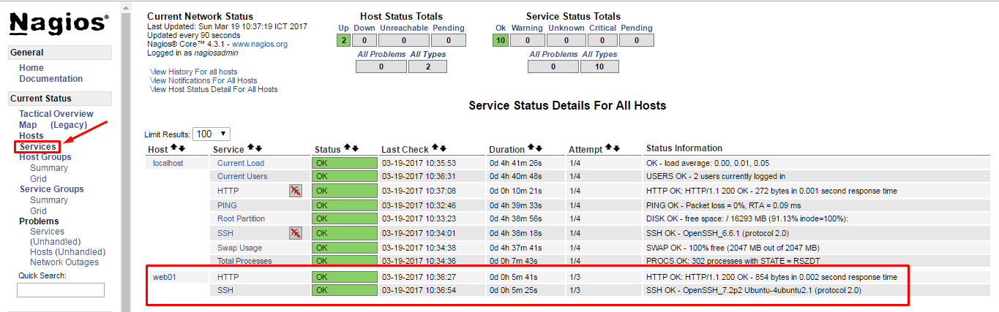

## Hướng dẫn cài đặt Nagios Core 4.3.1 trên CentOS 7

### Table of contents

- [ 1. Chuẩn bị ](#1)
    - [1.1 Chuẩn bị môi trường cài đặt](#1.1)
- [ 2. Cài đặt Nagios Server](#2)
    - [2.1 Tạo user cho Nagios](#2.1)
    - [2.2 Cài đặt Nagios Core và Plugin](#2.2)
    - [2.3 Cài đặt NRPE trên Nagios Server](#2.3)
    - [2.4 Khởi động Nagios Server](#2.4)
    - [2.5 Cấu hình giám sát host Linux trên Nagios Server](#2.5)
    - [2.6 Giám sát dịch vụ MySQL/MariaDB](#2.6)
    - [2.7 Giám sát dịch vụ RabbitMQ](#2.7)
- [3. Tham khảo](#3)

<a name="1.1"></a>
#### 1.1 Chuẩn bị môi trường cài đặt

#### Mô hình cài đặt giám sát các host như sau:


#### IP Planning


Link docs: https://goo.gl/yOim1o

<a name="2"></a>
### 2. Cài đặt Nagios Server

Để có thể cài đặt và sử dụng được Nagios Core, chúng ta phải cài đặt một số thư viện và các gói thư viện dịch vụ đi kèm.

- Cài đặt các gói thư viện

```
yum install gcc glibc glibc-common gd gd-devel make net-snmp openssl-devel xinetd unzip httpd php php-fpm curl wget -y
```

<a name="2.1"></a>
#### 2.1 Tạo user cho Nagios

Tạo user `nagios` trên máy chủ cài đặt Nagios Server

```sh
useradd -m -s /bin/bash nagios
```

- `-m`: Tạo thư mục home cho user
- `-s`: User sử dụng Bash Shell mặc định

Tạo group `nagcmd` cho phép sử dụng thư mục Web UI, thêm nagios và apache:

```sh
groupadd nagcmd
usermod -a -G nagcmd nagios
usermod -a -G nagcmd apache
```

<a name="2.2"></a>
#### 2.2 Cài đặt Nagios Core và Plugin

Chúng ta tải Nagios Core về server. Tại thời điểm viết bài, phiên bản mới nhất là Nagios Core 4.3.1. Để cập nhật mới nhất, vui lòng bấm vào [đây](https://www.nagios.org/download/).

```sh
wget http://prdownloads.sourceforge.net/sourceforge/nagios/nagios-4.3.1.tar.gz
```

Sau khi tải xong, chúng ta cùng giải nén và bắt đầu phần biên dịch Nagios Core và Plugin trên máy chủ mà ta muốn cài Nagios.

- **Bước 1**: Giải nén source Nagios

```sh
tar xf nagios-4.3.1.tar.gz
```

- **Bước 2**: Biên dịch Nagios

```
cd ~/nagios/nagios-4.3.1

./configure --with-command-group=nagcmd 
make all
make install
make install-commandmode
make install-init
make install-config
make install-webconf
```

- **Bước 3**: Cho phép nagios khởi động cùng với hệ thống:

```sh
chkconfig nagios on
```

- **Bước 4**: Cài đặt password cho `nagiosadmin`, khi đăng nhập Web:

```sh
htpasswd -c /usr/local/nagios/etc/htpasswd.users nagiosadmin
```

- **Bước 5**: Tải gói Plugin và giải nén

```sh
wget https://nagios-plugins.org/download/nagios-plugins-2.2.0.tar.gz
tar xzf nagios-plugins-2.2.0.tar.gz
```

- **Bước 6**: Biên dịch các Plugin từ source code

```
cd ~/nagios/nagios-plugins-2.2.0
./configure --with-nagios-user=nagios --with-nagios-group=nagios --with-openssl
make
make install
```

<a name="2.3"></a>
#### 2.3 Cài đặt NRPE trên Nagios Server

`NRPE` - (*Nagios Remote Plugin Executor*) là một công cụ đi kèm để theo dõi tài nguyên hệ thống, nó còn được biết như một Agent để theo dõi các host từ xa (Remote hosts).

**Mục đích của việc cài đặt này là để biên dịch ra plugin `check_nrpe`.**

- **Bước 1**: Tải và Giải nén source gói NRPE

```
curl -L -O http://downloads.sourceforge.net/project/nagios/nrpe-2.x/nrpe-2.15/nrpe-2.15.tar.gz

tar xf nrpe-*.tar.gz
```

- **Bước 2**: Biên dịch NRPE từ source

```
cd ~/nagios/nrpe-*

./configure --enable-command-args --with-nagios-user=nagios \
--with-nagios-group=nagios --with-ssl=/usr/bin/openssl \
--with-ssl-lib=/usr/lib/x86_64-linux-gnu

make all
make install
```

- **Bước 3**: Thêm câu lệnh `check_nrpe`

    - Mở file `/usr/local/nagios/etc/objects/command.cfg`:
    
    ```
    vi /usr/local/nagios/etc/objects/command.cfg
    ```
    - Thêm câu lệnh sau:
    
    ```
    ...
    define command{
        command_name check_nrpe
        command_line $USER1$/check_nrpe -H $HOSTADDRESS$ -c $ARG1$
    }
    ```
    
    - Thoát và lưu lại file.
    
<a name="2.4"></a>
#### 2.4 Khởi động Nagios Server

Khởi động lại Apache và chạy `nagios`, cho phép khởi động cùng hệ thống:

```sh
systemctl enable httpd
systemctl restart httpd
service nagios restart
chkconfig nagios on
```

Để kiểm tra, hãy truy cập vào giao diện Web và đăng nhập bằng `nagiosadmin` và Password vừa tạo ở địa chỉ:

```
http://địa-chỉ-ip/nagios
```


<a name="2.5"></a>
#### 2.5 Cấu hình giám sát 1 host Linux

Trên Nagios server, chúng ta tạo một thư mục đặt tất cả các file cấu hình host giám sát, sửa file cấu hình chính của `nagios`:

- **Bước 1**: Sửa file cấu hình của Nagios

```sh
vi /usr/local/nagios/etc/nagios.cfg
```

- **Bước 2**: Tìm và bỏ "#" ở dòng:

```
...
cfg_dir=/usr/local/nagios/etc/servers
...
```

- **Bước 3**: Tạo thư mục và file cấu hình host cần giám sát:

```
mkdir /usr/local/nagios/etc/servers
vi /usr/local/nagios/etc/servers/web01.cfg
```

Ở đây, chúng ta sẽ giám sát 2 dịch vụ SSH và HTTP

```
define host {
use                             linux-server
host_name                       web01		
alias                           web01
address                         192.168.100.199
max_check_attempts              5
check_period                    24x7
notification_interval           30
notification_period             24x7
}
define service {
    use                 generic-service
    host_name           web01
    service_description HTTP
    check_command       check_http
    normal_check_interval           5 
    retry_check_interval            2
}
define service {
    use                 generic-service
    host_name           web01
    service_description SSH
    check_command       check_ssh
}
```

- **Bước 4**: Sau khi chỉnh sửa xong, chúng ta lưu lại file và khởi động lại nagios.

```
systemctl restart nagios
```

- **Bước 5**: Vào giao diện Web để kiểm tra



<a name="2.6"></a>
#### 2.6 Giám sát MySQL

Vui lòng bấm vào [đây](4.Monitor-MySQL.md).

<a name="2.7"></a>
#### 2.7 Giám sát RabbitMQ

Vui lòng bấm vào [đây](5.Monitor-RabbitMQ.md).

<a name="3"></a>
### 3. Tham khảo

- https://assets.nagios.com/downloads/nagioscore/docs/nagioscore/4/en/quickstart-fedora.html