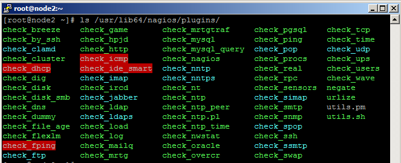
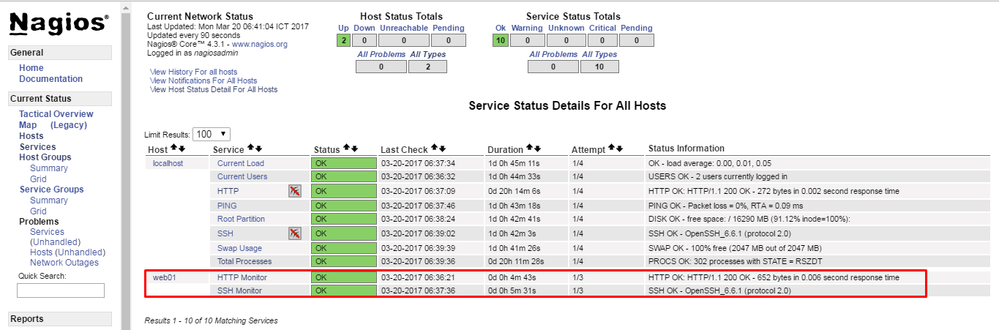

## Hướng dẫn cài đặt Nagios Core 4.3.1 trên CentOS 7

### Table of contents

- [ 1. Chuẩn bị ](#1)
    - [1.1 Chuẩn bị môi trường cài đặt](#1.1)
- [ 2. Cài đặt Nagios Server](#2)
    - [2.1 Cài đặt các gói chuẩn bị cần thiết](#2.1)
    - [2.2 Tạo user cho Nagios](#2.2)
    - [2.3 Cài đặt Nagios Core và Plugin](#2.3)
    - [2.4 Khởi động Nagios Server](#2.4)
- [3. Giám sát host/dịch vụ](#3)
    - [3.1 Giám sát host Linux thông qua NRPE](#3.1)
        - [3.1.1 Cài đặt NRPE trên Nagios Server](3.1.1)
        - [3.1.2 Cài đặt NRPE trên host cần giám sát](#3.1.2)
        - [3.1.3 Thêm thông tin host trên Nagios Server](#3.1.3)
        - [3.1.4 Kiểm tra trên Web UI của Nagios Server](#3.1.4)
    - [3.2 Giám sát dịch vụ MySQL/MariaDB](#3.2)
    - [3.3 Giám sát dịch vụ RabbitMQ](#3.3)
- [4. Tham khảo](#4)

<a name="1"></a>
### 1. Chuẩn bị

<a name="1.1"></a>
#### 1.1 Chuẩn bị môi trường cài đặt

#### Mô hình cài đặt giám sát các host như sau:


#### IP Planning


Link docs: https://goo.gl/yOim1o

<a name="2"></a>
### 2. Cài đặt Nagios trên Nagios Server

<a name="2.1"></a>
#### 2.1 Cài đặt các gói chuẩn bị cần thiết

Để có thể cài đặt và sử dụng được Nagios Core, chúng ta phải cài đặt một số thư viện và các gói thư viện dịch vụ đi kèm.

- Cài đặt các gói thư viện

```
yum install gcc glibc glibc-common gd gd-devel make net-snmp openssl-devel xinetd unzip httpd php php-fpm curl wget -y
```

- Tắt SELinux 

```
vi /etc/sysconfig/selinux
```

Sửa dòng `SELINUX=permissive` thành `SELINUX=disable`.

<a name="2.2"></a>
#### 2.2 Tạo user cho Nagios

Tạo user `nagios` trên máy chủ cài đặt Nagios Server

```sh
useradd -m -s /bin/bash nagios
```

- `-m`: Tạo thư mục home cho user
- `-s`: User sử dụng Bash Shell mặc định

Tạo group `nagcmd` cho phép sử dụng thư mục Web UI, thêm nagios và apache:

```sh
groupadd nagcmd
usermod -a -G nagcmd nagios
usermod -a -G nagcmd apache
```

<a name="2.3"></a>
#### 2.3 Cài đặt Nagios Core và Plugin

Chúng ta tải Nagios Core về server. Tại thời điểm viết bài, phiên bản mới nhất là Nagios Core 4.3.1. Để cập nhật mới nhất, vui lòng bấm vào [đây](https://www.nagios.org/download/).

```sh
wget http://prdownloads.sourceforge.net/sourceforge/nagios/nagios-4.3.1.tar.gz
```

Sau khi tải xong, chúng ta cùng giải nén và bắt đầu phần biên dịch Nagios Core và Plugin trên máy chủ mà ta muốn cài Nagios.

- **Bước 1**: Giải nén source Nagios

```sh
tar xf nagios-4.3.1.tar.gz
```

- **Bước 2**: Biên dịch Nagios

```
cd nagios-4.3.1

./configure --with-command-group=nagcmd 
make all
make install
make install-commandmode
make install-init
make install-config
make install-webconf
```

- **Bước 3**: Cho phép nagios khởi động cùng với hệ thống:

```sh
chkconfig nagios on
```

- **Bước 4**: Cài đặt password cho `nagiosadmin`, khi đăng nhập Web:

```sh
htpasswd -c /usr/local/nagios/etc/htpasswd.users nagiosadmin
```

- **Bước 5**: Tải gói Plugin và giải nén

```sh
wget https://nagios-plugins.org/download/nagios-plugins-2.2.0.tar.gz
tar xzf nagios-plugins-2.2.0.tar.gz
```

- **Bước 6**: Biên dịch các Plugin từ source code

```
cd nagios-plugins-2.2.0
./configure --with-nagios-user=nagios --with-nagios-group=nagios --with-openssl
make
make install
```

<a name="2.4"></a>

#### 2.4 Khởi động Nagios Server

Khởi động lại Apache và chạy `nagios`, cho phép khởi động cùng hệ thống:

```sh
systemctl enable httpd
systemctl restart httpd
service nagios restart
chkconfig nagios on
```

Để kiểm tra, hãy truy cập vào giao diện Web và đăng nhập bằng `nagiosadmin` và Password vừa tạo ở địa chỉ:

```
http://192.168.100.196/nagios
```


<a name="3"></a>
### 3. Giám sát host/dịch vụ trên Linux

<a name="3.1"></a>
#### 3.1 Giám sát thông qua NRPE

<a name="3.1.1"></a>
#### 3.1.1 Cài đặt NRPE trên Nagios Server

`NRPE` - (*Nagios Remote Plugin Executor*) là một công cụ đi kèm để theo dõi tài nguyên hệ thống, nó còn được biết như một Agent để theo dõi các host từ xa (Remote hosts).

**Mục đích của việc cài đặt này là để biên dịch ra plugin `check_nrpe`.**

- **Bước 1**: Tải và Giải nén source gói NRPE

```
curl -L -O http://downloads.sourceforge.net/project/nagios/nrpe-2.x/nrpe-2.15/nrpe-2.15.tar.gz

tar xf nrpe-*.tar.gz
```

- **Bước 2**: Biên dịch NRPE từ source

```
cd nrpe-*

./configure --enable-command-args --with-nagios-user=nagios \
--with-nagios-group=nagios --with-ssl=/usr/bin/openssl \
--with-ssl-lib=/usr/lib/x86_64-linux-gnu

make all
make install
```

- **Bước 3**: Thêm câu lệnh `check_nrpe`

    - Mở file `/usr/local/nagios/etc/objects/command.cfg`:
    
    
    ```
    vi /usr/local/nagios/etc/objects/command.cfg
    ```
    
    - Thêm câu lệnh sau:
    
    
    ```
    ...
    define command{
        command_name check_nrpe
        command_line $USER1$/check_nrpe -H $HOSTADDRESS$ -c $ARG1$
    }
    ```
    
    - Thoát và lưu lại file.
    
<a name="3.1.2"></a>
##### 3.1.2 Cài đặt NRPE trên host cần giám sát

Trên host Linux cần giám sát, chúng ta cần thực hiện các bước sau:

- **Bước 1**: Cập nhật repo cho host

    - Đối với client sử dụng CentOS, cài đặt repo `epel-release`:
    
    ```
    yum install epel-release
    ```
    
    - Đối với client sử dụng Ubuntu:
    
    ```
    apt-get update
    ```
  
- **Bước 2**: Cài đặt NRPE và các Plugin trên host cần giám sát

    - Đối với client sử dụng CentOS, cài đặt repo `epel-release`:
    
    ```
    yum install nrpe nagios-plugins-all
    ```
    
    - Đối với client sử dụng Ubuntu:
    
    ```
    apt-get install nagios-plugins nagios-nrpe-server
    ```
    
- **Bước 3**: Cấu hình NRPE trên host cần giám sát

*Bước này có thể làm trên cả 2 distro CentOS và Ubuntu.*

**Sửa file cấu hình NRPE**

```
vi /etc/nagios/nrpe.cfg
```
    
**Cho phép Server Nagios có quyền truy cập và sử dụng NRPE**

Tìm trường `allowed_hosts` và thêm địa chỉ IP Nagios server của bạn vào. Mỗi IP cách nhau bởi dấu phẩy (,):

```
allowed_hosts=127.0.0.1, 192.168.100.196
```

Đừng thoát khỏi file, làm tiếp theo bước dưới để khai báo câu lệnh cho NRPE.

**Thêm câu lệnh để check các dịch vụ**
    
Trên 2 distro CentOS và Ubuntu, thư mục chứa các plugin trên client là khác nhau:

- Với CentOS, thư mục chứa Plugin ở `/usr/lib64/nagios/plugins/`



- Với Ubuntu, thư mục chứa Plugin ở `/usr/lib/nagios/plugins/` 


    
Vì vậy, để thêm các lệnh check dịch vụ ở 2 distro cũng phải khai báo đúng đường dẫn trỏ tới thư mục chứa các plugin. Ở ví dụ này, tôi sẽ check 2 dịch vụ SSH và HTTP qua NRPE:

- Với CentOS


- Với Ubuntu


    
Lưu lại file và thoát.

**Để check các dịch vụ khác, chúng ta thêm câu lệnh tương tự với hướng dẫn bên trên. Lưu ý, cần chạy thử plugin trước để có hướng dẫn sử dụng.**

- **Bước 4**: Khởi động lại dịch vụ
    
    - Với host sử dụng CentOS
    
    ```
    systemctl restart nrpe.service
    systemctl enable nrpe.service
    ```
    
    - Với host sử dụng Ubuntu
    
    ```
    service nagios-nrpe-server restart
    ```

Sau khi cài đặt và cấu hình NRPE trên host mà chúng ta muốn giám sát, chúng ta cần phải thêm host đó vào cấu hình Nagios Server trước khi bắt đầu giám sát nó.

<a name="3.1.3"></a>
##### 3.1.3 Thêm thông tin host trên Nagios Server

Trên Nagios Server, tạo file cấu hình cho mỗi host mà bạn muốn giám sát chúng ở folder `/usr/local/nagios/etc/servers/`. Trong trường hợp của tôi, tôi sẽ đặt tên cho nó là `web01.cfg`

```
vi /usr/local/nagios/etc/servers/web01.cfg
```

Thêm nội dung sau vào file, phần `host_name` để định nghĩa ra một host mới, `alias` là phần mô tả ngắn về host; `address` là địa chỉ IP của host cần giám sát.

```
define host {
        use                             linux-server
        host_name                       web01
        alias                           My Apache server
        address                         192.168.100.199
        max_check_attempts              5
        check_period                    24x7
        notification_interval           30
        notification_period             24x7
}
```

Với phần cấu hình trên, chúng ta chỉ có thể theo dõi được trạng thái UP/DOWN của host cần giám sát. Để giám sát thêm các dịch vụ, chúng ta tạo thêm các khối `service` trong phần cấu hình. `check_command` có thể được thêm và cài đặt các ngưỡng cảnh báo.

HTTP:

```
define service {
        use                             generic-service
        host_name                       web01
        service_description             SSH Monitor
        check_command                   check_nrpe!check_ssh
}
```

SSH:

```
define service {
        use                             generic-service
        host_name                       web01
        service_description             HTTP Monitor
        check_command                   check_nrpe!check_http
        notifications_enabled           0
}
```

    *Chú thích:*
    - `use generic-service`: Sử dụng templete có sẵn cho các dịch vụ
    - `notifications_enabled 0`: Tắt cảnh báo khi dịch vụ thay đổi trạng thái

Đây là file `web01.cfg` hoàn chỉnh, theo dõi 2 dịch vụ HTTP và SSH qua NRPE:

```
define host {
        use                             linux-server
        host_name                       web01
        alias                           My Apache server
        address                         192.168.100.199
        max_check_attempts              5
        check_period                    24x7
        notification_interval           30
        notification_period             24x7
}
define service {
        use                             generic-service
        host_name                       web01
        service_description             SSH Monitor
        check_command                   check_nrpe!check_ssh
}
define service {
        use                             generic-service
        host_name                       web01
        service_description             HTTP Monitor
        check_command                   check_nrpe!check_http
        notifications_enabled           0
}
```

Sau khi sửa xong, chúng ta lưu lại file và khởi động lại nagios server.

```
systemctl reload nagios.service
```

<a name="3.1.4"></a>
##### 3.1.4 Kiểm tra trên Web UI của Nagios Server

Vào giao diện Web để kiểm tra lại:

```
http://192.168.100.196/nagios
```

- **Bước 1**: Bấm vào **Service**

Chúng ta sẽ thấy một host mới có tên `web01` được thêm mới và các dịch vụ đang ở trạng thái `PENDING`.


Mặc định khi mới thêm host, Nagios Server chưa check các dịch vụ. Để check xem dịch vụ trên host có chạy hay không? Chúng ta bấm vào dịch vụ cần check, ở đây tôi sẽ chọn dịch vụ `HTTP`.


- **Bước 2**: Bấm vào **Re-schedule the next check of this service**

Khi click vào, chúng ta thấy một thông báo "**This service has not yet been checked, so status information is not avaliable.**", Đừng lo lắng, hãy click vào phần tô đỏ **Re-schedule the next check of this service** để force lượt check tiếp theo.


- **Bước 3**: Click tiếp vào **Commit**.


- **Bước 4**: Click tiếp vào **Done**.


- **Bước 5**: Thông tin dịch vụ đã được check sẽ hiện ra như sau:


Tương tự, nếu bạn muốn check dịch vụ khác. Với ví dụ, này là `SSH`, các bạn thao tác lại như với dịch vụ `HTTP` mà tôi vừa hướng dẫn bên trên.

Sau khi Nagios Server check xong các dịch vụ, Dashboard sẽ hiển thị như sau:



Như vậy, 2 dịch vụ mà chúng ta giám sát trên host hoạt động bình thường.

<a name="3.2"></a>
#### 3.2 Giám sát dịch vụ MySQL

Vui lòng bấm vào [đây](4.Monitor-MySQL.md).

<a name="3.3"></a>
#### 3.3 Giám sát dịch vụ RabbitMQ

Vui lòng bấm vào [đây](5.Monitor-RabbitMQ.md).

<a name="4"></a>
### 4. Tham khảo

- https://assets.nagios.com/downloads/nagioscore/docs/nagioscore/4/en/quickstart-fedora.html