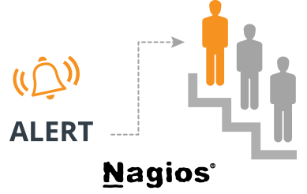

## Hướng dẫn cấu hình cảnh báo leo thang trong Nagios

### Table of Contents

- [1. Giới thiệu](#1)
- [2. Các bước tiến hành](#2)
    - [2.1 Cấu hình `contact` và `group` nhận cảnh báo](#2.1)
    - [2.2 Cấu hình cảnh báo theo `host`](#2.2)
    - [2.3 Cấu hình cảnh báo theo `service`](#2.3)
- [3. Tham khảo](#3)

<a name="1"></a>   
### 1. Giới thiệu

Ở phần này chúng ta có thể hiểu nôm na rằng. Khi một host/service thay đổi trạng thái, mail cảnh báo sẽ gửi tới một người hoặc một nhóm thứ nhất đã được đặt. Nếu quá khoảng thời gian chúng ta đặt cho người/nhóm thứ nhất, Nagios sẽ gửi thông báo tới nhóm thứ 2.



<a name="2"></a>
### 2. Các bước tiến hành

<a name="2.1"></a>
#### 2.1 Cấu hình `contact` và `group` nhận cảnh báo

    - **Bước 1:** Mở file cấu hình `contacts`

    ```
    vi /usr/local/nagios/etc/objects/contacts.cfg
    ```

    - **Bước 2:** Thêm `contact` và `group` vào file cấu hình

    ```
    ...
    define contact{
            contact_name     mem1
            use				 generic-contact
            alias            Member 1
            email            mem1@example.com
            service_notification_period     24x7	
            host_notification_period        24x7	
            service_notification_options    w,u,c,r,f,s
            host_notification_options       d,u,r,f,s
            service_notification_commands   notify-service-by-email	
            host_notification_commands      notify-host-by-email
    }       
    define contact{
            contact_name     mem2
            use				 generic-contact
            alias            Member 2
            email            mem2@example.com
            service_notification_period     24x7	
            host_notification_period        24x7	
            service_notification_options    w,u,c,r,f,s
            host_notification_options       d,u,r,f,s
            service_notification_commands   notify-service-by-email	
            host_notification_commands      notify-host-by-email
    }       
    define contact{
            contact_name     mem3
            use				 generic-contact
            alias            Member 3
            email            mem3@example.com
            service_notification_period     24x7	
            host_notification_period        24x7	
            service_notification_options    w,u,c,r,f,s
            host_notification_options       d,u,r,f,s
            service_notification_commands   notify-service-by-email	
            host_notification_commands      notify-host-by-email
    }       
    define contact{
            contact_name     mem4
            use				 generic-contact
            alias            Member 4
            email            mem4@example.com
            service_notification_period     24x7	
            host_notification_period        24x7	
            service_notification_options    w,u,c,r,f,s
            host_notification_options       d,u,r,f,s
            service_notification_commands   notify-service-by-email	
            host_notification_commands      notify-host-by-email
    }  
    define contactgroup{
            contactgroup_name       admin1
            alias                   Technical Support
            members                 mem1, mem3
    }
            
    define contactgroup{
            contactgroup_name       admin2
            alias                   Technical Support Pro
            members                 mem2, mem4
    }
    ```

    **CHÚ Ý:** 
        - Thay địa chỉ email của các thành viên vào trường `email`.
        - `Group` có thể có nhiều `contact`, mỗi `contact` được phân cách nhau bởi dấu phẩy (,).

<a name="2.2"></a>
#### 2.2 Cấu hình cảnh báo theo `host`

    - **Bước 1**: Mở file cấu hình của `host`

    Trong bài hướng dẫn cài đặt lần trước, tôi đã giám sát 1 host có tên là `web01.cfg`.

    ```
    vi /usr/local/nagios/etc/servers/web01.cfg
    ```

    - **Bước 2**: Thêm cấu hình cảnh báo

    ```
    ...
    define hostescalation {
            host_name web01
            contact_groups admin1
            first_notification 2
            last_notification 3
            notification_interval 15
    }
    define hostescalation {
            host_name web01
            contact_groups admin2
            first_notification 3
            last_notification 5
            notification_interval 30
    }
    ```

    **Chú thích:**

    - `host_name`: Xác định hostname đặt cảnh báo
    - `contact_groups`: (Các) Nhóm nhận mail cảnh báo
    - `first_notification`: Tin cảnh báo được gửi từ tin thứ 2
    - `last_notification`: Số tin cảnh báo gửi đến cuối cùng. Ví dụ `10`, bản tin thứ 10 đã được nagios gửi đi, bản tin số 11 sẽ không được gửi vào nhóm này. Nếu muốn nhận cho đến khi host UP, đặt 0.
    - `notification_interval`: Thời gian gửi đi bản tin tiếp theo.

    - **Bước 3:** Lưu file và khởi động lại dịch vụ

    ```
    service nagios restart
    ```

<a name="2.3"></a>
#### 2.3 Cấu hình cảnh báo theo `service`


    - **Bước 1**: Mở file cấu hình của `host`

    Bây giờ, tôi sẽ đặt cảnh báo cho nó ở dịch vụ `HTTP` ở host `web01.cfg`.

    ```
    vi /usr/local/nagios/etc/servers/web01.cfg
    ```

    - **Bước 2**: Thêm cấu hình cảnh báo

    ```
    ...
    define service {
            use                             generic-service
            host_name                       web01
            service_description             HTTPMonitor
            check_command                   check_nrpe!check_http
            notification_period             24x7
            check_period		        	24x7
            check_interval		        	3 
    }
    define serviceescalation {
        host_name		web01
        service_description	    HTTPMonitor
        first_notification	2
        last_notification	3
        notification_interval	3
        contact_groups		admin1
    }
    define serviceescalation {
        host_name       web01
        service_description     HTTPMonitor
        first_notification	3
        last_notification	0
        notification_interval	5
        contact_groups		admin2
    }	
    ```

    **Chú thích:**

            - `service_description`: Phần mô tả của dịch vụ, chú ý nên viết liền như mẫu `HTTPMonitor`. Cấu hình `*` để chọn tất cả các dịch vụ đang theo dõi.
            - `escalation_options`: Trạng thái của dịch vụ R - OK, W - Warnning, C - Critical,...
        
    - **Bước 3:** Lưu file và khởi động lại dịch vụ

    ```
    service nagios restart
    ```
    
### 3. Tham khảo

- https://assets.nagios.com/downloads/nagioscore/docs/nagioscore/3/en/escalations.html